# LMSilo Core - Comprehensive Overview

> **Local AI Suite for Enterprise and Air-gapped Environments**

A self-hosted, privacy-first AI platform providing speech-to-text, image geolocation, and multilingual translation capabilities—all running entirely on your infrastructure with no data leaving your network.

---

## Table of Contents

- [Executive Summary](#executive-summary)
- [System Architecture](#system-architecture)
- [Service Components](#service-components)
  - [Portal](#portal---landing-page)
  - [Locate](#locate---image-geolocation)
  - [Transcribe](#transcribe---speech-to-text)
  - [Translate](#translate---multilingual-translation)
- [Shared Infrastructure](#shared-infrastructure)
- [Data Flow & User Journey](#data-flow--user-journey)
- [Technology Stack](#technology-stack)
- [Security & Compliance](#security--compliance)
- [Developer Guide](#developer-guide)
- [Deployment Architecture](#deployment-architecture)
- [Feature Analysis](#feature-analysis)
- [Actionable Insights & Questions](#actionable-insights--questions)

---

## Executive Summary

### Product Manager Perspective

LMSilo addresses a critical market need: **enterprise AI processing without cloud dependencies**. Key value propositions:

| Feature                  | Business Value                                                       |
| ------------------------ | -------------------------------------------------------------------- |
| **Offline-capable**      | Ideal for air-gapped, classified, or privacy-sensitive environments  |
| **Multi-tool suite**     | Single deployment covers transcription, translation, and geolocation |
| **Shared audit logging** | Built-in compliance and usage tracking across all services           |
| **GPU acceleration**     | Production-ready performance with CUDA/ROCm support                  |

### Software Architect Perspective

The system employs a **microservices architecture** with:

- Containerized services orchestrated via Docker Compose
- Shared PostgreSQL database for job queues and audit logs
- Redis for Celery message brokering and caching
- Volume-mounted model caching for faster startup times

### Software Developer Perspective

Clean, maintainable codebase featuring:

- Python/FastAPI backends with async SQLAlchemy
- React/TypeScript frontends with TailwindCSS
- Celery workers for background AI processing
- Shared library (`/shared`) for cross-service utilities

---

## System Architecture

### High-Level Overview

```mermaid
graph TB
    subgraph "User Interface Layer"
        Portal["🖥️ Portal<br/>React Landing Page<br/>Port 80"]
        LocateFE["📍 Locate Frontend<br/>React + Vite"]
        TranscribeFE["🎙️ Transcribe Frontend<br/>React + Vite"]
        TranslateFE["🌐 Translate Frontend<br/>React"]
    end

    subgraph "API Layer"
        LocateAPI["Locate API<br/>FastAPI<br/>Port 8081"]
        TranscribeAPI["Transcribe API<br/>FastAPI<br/>Port 8082"]
        TranslateAPI["Translate API<br/>FastAPI<br/>Port 8083"]
    end

    subgraph "Processing Layer"
        LocateWorker["Celery Worker<br/>GeoCLIP Model"]
        TranscribeWorker["Celery Worker<br/>Whisper Models"]
        TranslateWorker["Celery Worker<br/>NLLB-200"]
    end

    subgraph "Storage Layer"
        PostgreSQL[("PostgreSQL 16<br/>Jobs, Models, Audit")]
        Redis[("Redis 7<br/>Message Broker")]
        HFCache["HuggingFace<br/>Model Cache"]
    end

    Portal --> LocateAPI
    Portal --> TranscribeAPI
    Portal --> TranslateAPI

    LocateFE --> LocateAPI
    TranscribeFE --> TranscribeAPI
    TranslateFE --> TranslateAPI

    LocateAPI --> PostgreSQL
    TranscribeAPI --> PostgreSQL
    TranslateAPI --> PostgreSQL

    LocateAPI --> Redis
    TranscribeAPI --> Redis
    TranslateAPI --> Redis

    Redis --> LocateWorker
    Redis --> TranscribeWorker
    Redis --> TranslateWorker

    LocateWorker --> HFCache
    TranscribeWorker --> HFCache
    TranslateWorker --> HFCache
```



### Container Architecture


---

## Service Components

### Portal - Landing Page

**Purpose**: Central hub providing navigation to all LMSilo tools.

**Technology**: React + Vite + TailwindCSS + Nginx

**Features**:

- Dark/light theme toggle with localStorage persistence
- Configurable ticker banner via `PORTAL_TICKER` environment variable
- Responsive grid layout for service cards
- Modern, minimal design with serif typography

**Port**: 80

```
portal/
├── src/
│   ├── App.tsx           # Main component with theme & ticker
│   ├── index.css         # TailwindCSS styles
│   └── main.tsx          # React entry point
├── Dockerfile            # Multi-stage build with Nginx
└── nginx.conf            # Static file serving
```

---

### Locate - Image Geolocation

**Purpose**: AI-powered geolocation prediction using GeoCLIP model.

**Technology**: FastAPI + GeoCLIP + Celery + React

**Features**:

- **GeoCLIP Model**: State-of-the-art CLIP-based geolocation
- **Top-K Predictions**: Multiple location candidates with confidence scores
- **Batch Processing**: Process multiple images in a single request
- **Reverse Geocoding**: Returns city, state, county, country for each prediction
- **EXIF Panel**: Extract and display image metadata
- **MapView**: Interactive map visualization of predictions

**Port**: 8081

#### Architecture Flow


#### Directory Structure

```
locate/
├── backend/
│   ├── main.py              # FastAPI app with /infer endpoint
│   ├── api/
│   │   └── jobs.py          # Job CRUD operations
│   ├── models/
│   │   └── job.py           # SQLAlchemy Job model
│   ├── services/
│   │   ├── database.py      # Async session management
│   │   └── model_manager.py # GeoCLIP with idle timeout
│   ├── workers/
│   │   ├── celery_app.py    # Celery configuration
│   │   └── tasks.py         # Geolocation processing task
│   └── llocale/             # GeoCLIP predictor implementation
├── frontend/
│   └── src/
│       ├── components/
│       │   ├── ImageUploader.tsx
│       │   ├── ImageQueue.tsx
│       │   ├── MapView.tsx
│       │   └── PredictionResults.tsx
│       └── pages/
│           ├── HomePage.tsx
│           └── SettingsPage.tsx
└── Dockerfile               # All-in-one container
```

---

### Transcribe - Speech-to-Text

**Purpose**: Audio/video transcription with speaker diarization.

**Technology**: FastAPI + Faster-Whisper/WhisperX + Pyannote + Celery

**Features**:

- **Multiple Engines**: Faster-Whisper, WhisperX, HuggingFace Whisper
- **Speaker Diarization**: Identify and label speakers using Pyannote
- **Batch Processing**: Queue multiple files for background processing
- **Output Formats**: JSON, SRT, VTT, TXT
- **Subtitle Burning**: Embed subtitles directly into video
- **Transcript Editing**: Inline segment editing with speaker renaming
- **Real-time Updates**: WebSocket-based progress notifications
- **Model Management**: Download and manage Whisper models

**Port**: 8082

#### API Endpoints

| Endpoint                               | Method    | Description                       |
| -------------------------------------- | --------- | --------------------------------- |
| `/api/jobs`                            | POST      | Create transcription job          |
| `/api/jobs`                            | GET       | List all jobs                     |
| `/api/jobs/{id}`                       | GET       | Get job details                   |
| `/api/jobs/{id}/transcript`            | GET       | Get transcript (json/srt/vtt/txt) |
| `/api/transcripts/{id}/segments/{idx}` | PATCH     | Edit transcript segment           |
| `/api/models`                          | GET       | List installed models             |
| `/api/models/{id}/download`            | POST      | Download model                    |
| `/api/queue`                           | WebSocket | Real-time queue updates           |
| `/api/stream/{id}`                     | WebSocket | Real-time job progress            |

#### Configuration Options

```python
# Key settings from config.py
default_whisper_model: str = "large-v3"
default_language: str = "auto"  # Auto-detection
device: str = "cuda"            # cuda, cpu, auto
compute_type: str = "float16"   # float16, int8, float32
max_concurrent_jobs: int = 2
```

---

### Translate - Multilingual Translation

**Purpose**: AI-powered translation supporting 200+ languages via Meta's NLLB-200 model.

**Technology**: FastAPI + NLLB-200 + Celery + React

**Features**:

- **200+ Languages**: Full NLLB-200 language coverage including low-resource languages
- **Auto-Detection**: Automatic source language detection
- **Document Translation**: Translate full documents with formatting preservation
- **Batch Translation**: Process multiple texts in a single request
- **Model Management**: Download and manage NLLB model variants
- **Shared Workspace**: All users see translation job queue
- **Audit Logging**: Full usage tracking with export

**Port**: 8083

#### Architecture Flow


#### API Endpoints

| Endpoint | Method | Description |
|----------|--------|-------------|
| `/translate` | POST | Translate single text (sync) |
| `/translate/batch` | POST | Batch translation (up to 1000 texts) |
| `/languages` | GET | List all 200+ supported languages |
| `/api/jobs` | POST | Create translation job (async) |
| `/api/jobs` | GET | List all jobs |
| `/api/jobs/{id}` | GET | Get job status and results |
| `/api/jobs/{id}` | DELETE | Delete job |
| `/api/documents` | POST | Upload document for translation |
| `/models` | GET | List installed models |
| `/models/builtin` | GET | List available NLLB variants |
| `/models` | POST | Register model |
| `/models/{id}/download` | POST | Download model |
| `/models/{id}` | DELETE | Delete model |

#### Request/Response Examples

**Single Translation:**
```json
// POST /translate
{
  "text": "Hello, how are you?",
  "source_lang": null,  // auto-detect
  "target_lang": "fra_Latn"  // French
}

// Response
{
  "text": "Hello, how are you?",
  "source_lang": "eng_Latn",
  "target_lang": "fra_Latn",
  "translation": "Bonjour, comment allez-vous?"
}
```

**Batch Translation:**
```json
// POST /translate/batch
{
  "texts": ["Hello", "Goodbye", "Thank you"],
  "target_lang": "deu_Latn"  // German
}

// Response
{
  "results": [...],
  "count": 3,
  "stats": {"avg_time_ms": 45}
}
```

#### NLLB Model Variants

| Model | Size | RAM Required | Quality | Use Case |
|-------|------|--------------|---------|----------|
| `nllb-200-distilled-600M` | 1.2GB | ~4GB | Good | Development, low-resource |
| `nllb-200-distilled-1.3B` | 2.6GB | ~8GB | Better | Balanced performance |
| `nllb-200-1.3B` | 5.2GB | ~12GB | High | Production |
| `nllb-200-3.3B` | 13GB | ~24GB | Best | Maximum quality |

#### Directory Structure

```
translate/
├── backend/
│   ├── main.py              # FastAPI app with /translate endpoints
│   ├── api/
│   │   ├── jobs.py          # Translation job CRUD
│   │   ├── models.py        # Model management API
│   │   └── documents.py     # Document translation
│   ├── models/
│   │   ├── database.py      # Model registry
│   │   └── job.py           # Translation job model
│   ├── schemas/
│   │   └── translation.py   # Pydantic request/response schemas
│   ├── services/
│   │   ├── model_manager.py # NLLB model loading with idle timeout
│   │   └── translator.py    # Core translation logic
│   ├── workers/
│   │   ├── celery_app.py    # Celery configuration
│   │   └── tasks.py         # Async translation tasks
│   └── nllb_lang_codes.py   # 200+ language code mappings
├── frontend/
│   └── src/
│       ├── components/
│       │   ├── LanguageSelector.tsx
│       │   ├── TranslationInput.tsx
│       │   └── AuditLogViewer.tsx
│       └── pages/
│           ├── Home.tsx
│           ├── Models.tsx
│           └── Settings.tsx
└── Dockerfile               # All-in-one container
```

---

## Shared Infrastructure

### Audit Logging System

All services share a centralized audit logging system for compliance and debugging.


#### Audit Log Schema

| Field                | Type        | Description                        |
| -------------------- | ----------- | ---------------------------------- |
| `id`                 | UUID        | Primary key                        |
| `service`            | String(20)  | locate, transcribe, translate      |
| `action`             | String(50)  | job_created, job_completed, etc.   |
| `timestamp`          | DateTime    | Event timestamp                    |
| `username`           | String(100) | User identity (Windows auth or IP) |
| `ip_address`         | String(45)  | Client IP (IPv4/IPv6)              |
| `user_agent`         | Text        | Browser/client info                |
| `job_id`             | UUID        | Related job reference              |
| `file_hash`          | String(64)  | SHA-256/xxHash of processed file   |
| `file_name`          | String(255) | Original filename                  |
| `file_size_bytes`    | BigInteger  | File size                          |
| `processing_time_ms` | Integer     | Processing duration                |
| `model_used`         | String(100) | ML model identifier                |
| `status`             | String(20)  | success, failed                    |
| `error_message`      | Text        | Error details                      |
| `metadata`           | JSONB       | Additional flexible data           |

### User Identification

The system supports multiple authentication methods:

1. **X-Remote-User header**: Windows auth via reverse proxy
2. **X-Forwarded-User header**: Alternative proxy auth
3. **Authorization Bearer token**: JWT-based auth (future)
4. **IP address fallback**: Anonymous user tracking

---

## Data Flow & User Journey

### Typical User Flow


---

## Technology Stack

### Backend

| Component     | Technology | Version     |
| ------------- | ---------- | ----------- |
| Web Framework | FastAPI    | Latest      |
| ORM           | SQLAlchemy | 2.x (async) |
| Task Queue    | Celery     | 5.x         |
| Database      | PostgreSQL | 16          |
| Cache/Broker  | Redis      | 7           |

### Frontend

| Component  | Technology   |
| ---------- | ------------ |
| Framework  | React 18     |
| Language   | TypeScript   |
| Build Tool | Vite         |
| Styling    | TailwindCSS  |
| Icons      | Lucide React |

### AI/ML

| Service    | Model/Library                      |
| ---------- | ---------------------------------- |
| Locate     | GeoCLIP (CLIP-based)               |
| Transcribe | Faster-Whisper, WhisperX, Pyannote |
| Translate  | NLLB-200 (Meta)                    |

### DevOps

| Component        | Technology                     |
| ---------------- | ------------------------------ |
| Containerization | Docker, Docker Compose         |
| GPU Support      | NVIDIA CUDA, AMD ROCm          |
| Web Server       | Nginx (Portal), Uvicorn (APIs) |

---

## Security & Compliance

### Security Features

1. **Network Isolation**: All processing happens on-premise
2. **No External Calls**: Designed for air-gapped deployment
3. **File Hashing**: SHA-256/xxHash for file integrity
4. **Audit Trail**: Complete logging of all operations
5. **User Tracking**: Windows auth integration support

### Compliance Considerations

- **GDPR**: Data never leaves infrastructure
- **HIPAA**: Supports isolated deployment for healthcare
- **FedRAMP**: Suitable for government/classified networks

---

## Developer Guide

### Quick Start

```bash
# Clone with submodules
git clone --recurse-submodules https://github.com/LJAM96/lmsilo-core.git
cd lmsilo-core

# Configure environment
cp .env.example .env
# Edit .env: Add HF_TOKEN for Pyannote models

# Start all services
docker compose up -d

# Access services
# Portal:     http://localhost
# Locate:     http://localhost:8081
# Transcribe: http://localhost:8082
# Translate:  http://localhost:8083
```

### Environment Variables

| Variable             | Description                                   | Default             |
| -------------------- | --------------------------------------------- | ------------------- |
| `HF_TOKEN`           | HuggingFace API token (required for Pyannote) | -                   |
| `DEVICE`             | Compute device: auto, cpu, cuda, rocm         | auto                |
| `COMPUTE_TYPE`       | Precision: float16, float32, int8             | auto                |
| `MODEL_IDLE_TIMEOUT` | Seconds before unloading inactive models      | 600                 |
| `PORTAL_TICKER`      | Scrolling banner message                      | "Welcome to LMSilo" |

### GPU Acceleration

Enable NVIDIA GPU support by uncommenting in `docker-compose.yml`:

```yaml
deploy:
  resources:
    reservations:
      devices:
        - driver: nvidia
          count: 1
          capabilities: [gpu]
```

Or use the provided CUDA override:

```bash
docker compose -f docker-compose.yml -f docker-compose.cuda.yml up -d
```

---

## Deployment Architecture

### Production Topology


---

## Feature Analysis

### Current Capabilities ✅

| Feature                  | Status      | Notes                          |
| ------------------------ | ----------- | ------------------------------ |
| Image Geolocation        | ✅ Complete | GeoCLIP with top-K predictions |
| Speech-to-Text           | ✅ Complete | Multi-engine Whisper support   |
| Speaker Diarization      | ✅ Complete | Pyannote integration           |
| Multilingual Translation | ✅ Complete | 200+ languages via NLLB        |
| Audit Logging            | ✅ Complete | Cross-service shared module    |
| Model Management         | ✅ Complete | Download/manage ML models      |
| Real-time Updates        | ✅ Complete | WebSocket progress events      |
| GPU Acceleration         | ✅ Complete | CUDA + ROCm support            |

### Potential Gaps 🔍

| Area               | Observation                     | Impact             |
| ------------------ | ------------------------------- | ------------------ |
| Authentication     | No built-in auth beyond headers | Medium             |
| Rate Limiting      | Not implemented                 | Low (internal use) |
| Service Mesh       | No inter-service observability  | Low                |
| Horizontal Scaling | Single-instance design          | Medium             |

---

## Actionable Insights & Questions

### For Product Managers

1. **User Analytics**: Consider adding usage metrics dashboard

   - Which services are most used?
   - Average processing times by file type?
   - Peak usage hours?

2. **Feature Prioritization**:

   - Video subtitle burning is available—is this being marketed?
   - Should batch job import from CSV/folder be added?

3. **Enterprise Readiness**:
   - Is SSO/LDAP integration on the roadmap?
   - What SLA guarantees are needed for air-gapped deployments?

### For Software Architects

1. **Scalability**:

   - Consider Kubernetes Helm charts for enterprise customers
   - Implement horizontal pod autoscaling for workers

2. **Resilience**:

   - Add circuit breakers for model loading failures
   - Implement dead-letter queues for failed jobs

3. **Observability**:
   - Add OpenTelemetry tracing
   - Implement Prometheus metrics (partial in `/metrics`)

### For Software Developers

1. **Code Quality**:

   - Add comprehensive unit tests (currently minimal)
   - Implement pre-commit hooks for linting

2. **API Consistency**:

   - Standardize error response format across services
   - Consider OpenAPI spec generation for client SDKs

3. **Technical Debt**:
   - Some hardcoded localhost URLs in portal should use environment variables
   - Consider consolidating shared frontend components across services

---

## Repository Structure

```
lmsilo-core/
├── .env.example              # Environment template
├── docker-compose.yml        # Full stack orchestration
├── docker-compose.cuda.yml   # NVIDIA GPU override
├── README.md                 # Quick start guide
├── OVERVIEW.md               # This document
├── portal/                   # Landing page (React)
│   ├── src/
│   │   └── App.tsx
│   └── Dockerfile
├── locate/                   # Submodule → lmsilo-locate
│   ├── backend/
│   │   ├── main.py
│   │   ├── api/
│   │   ├── models/
│   │   ├── services/
│   │   ├── workers/
│   │   └── llocale/
│   └── frontend/
├── transcribe/               # Submodule → lmsilo-transcribe
│   └── backend/
│       ├── main.py
│       ├── api/
│       ├── models/
│       └── services/
├── translate/                # Submodule → lmsilo-translate
│   ├── backend/
│   │   ├── main.py
│   │   ├── api/
│   │   ├── models/
│   │   ├── services/
│   │   ├── workers/
│   │   └── nllb_lang_codes.py
│   └── frontend/
└── shared/                   # Cross-service utilities
    ├── api/
    │   └── audit.py          # Audit API routes
    ├── models/
    │   └── audit.py          # AuditLog SQLAlchemy model
    └── services/
        └── audit.py          # AuditLogger service
```

---

## License

MIT License - See individual service repositories for dependencies.

---

_Document generated: December 2024_  
_Last updated: Auto-generated from codebase analysis_
